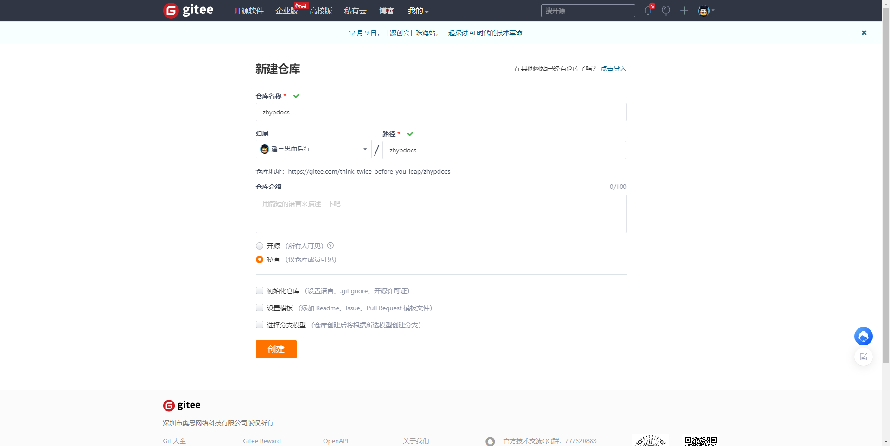
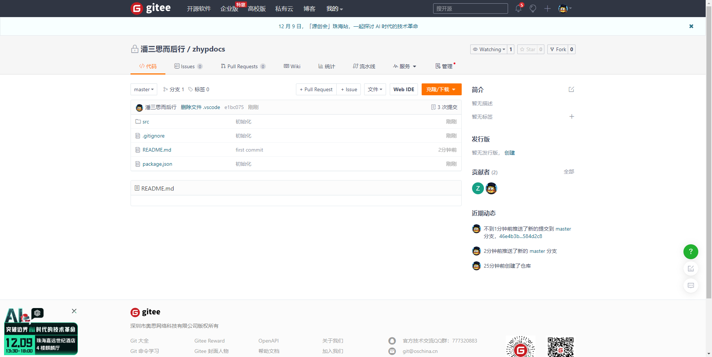
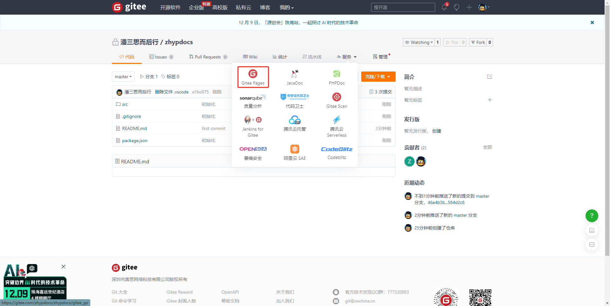

# Gitee部署静态网站

**基本环境**

* Git (同步仓库代码)
* Node (打包环境)
* Gitee (代码仓库)

## 1.初始化Gitee

### 1.1新建仓库




创建成功，如图


## 1.2推送到Gitee

进入项目目录，打包项目

执行命令

``` js
git add README.md
git commit -m "first commit"
git remote add origin https://gitee.com/zhypdocs/zhypdocs.git
git push -u origin "master"
```



点击服务菜单



实名认证太麻烦了，还是自己开个服务器吧。哈哈哈哈