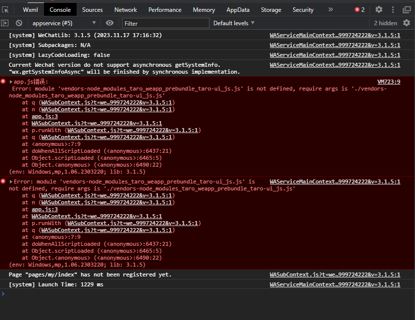
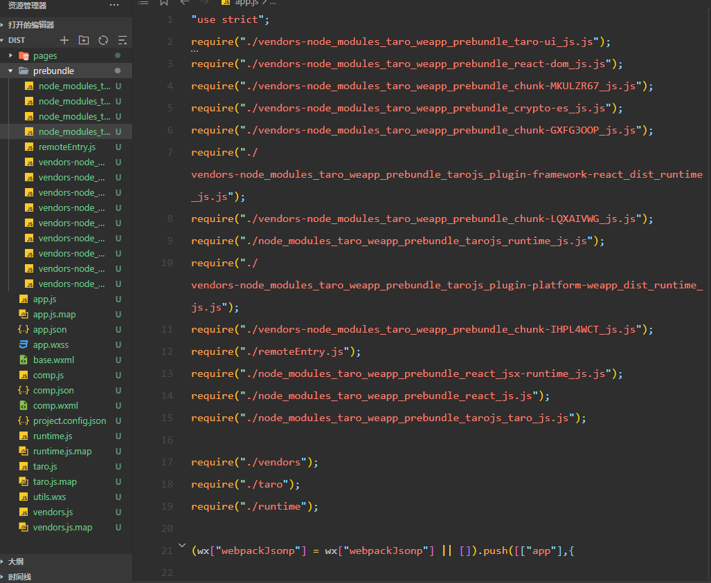
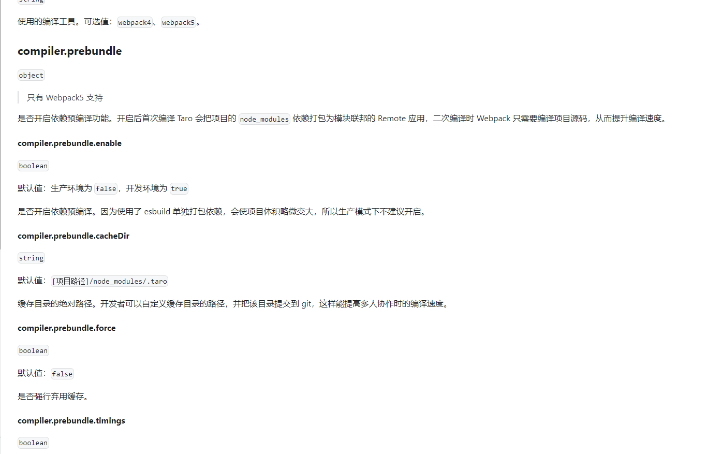
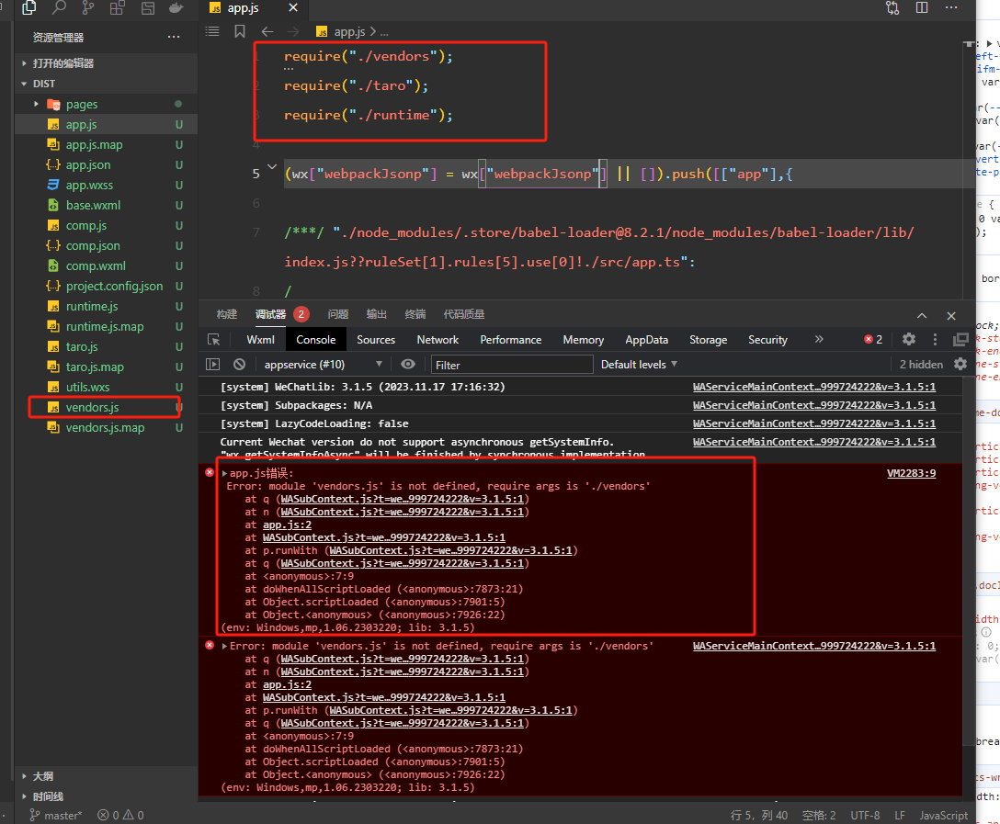
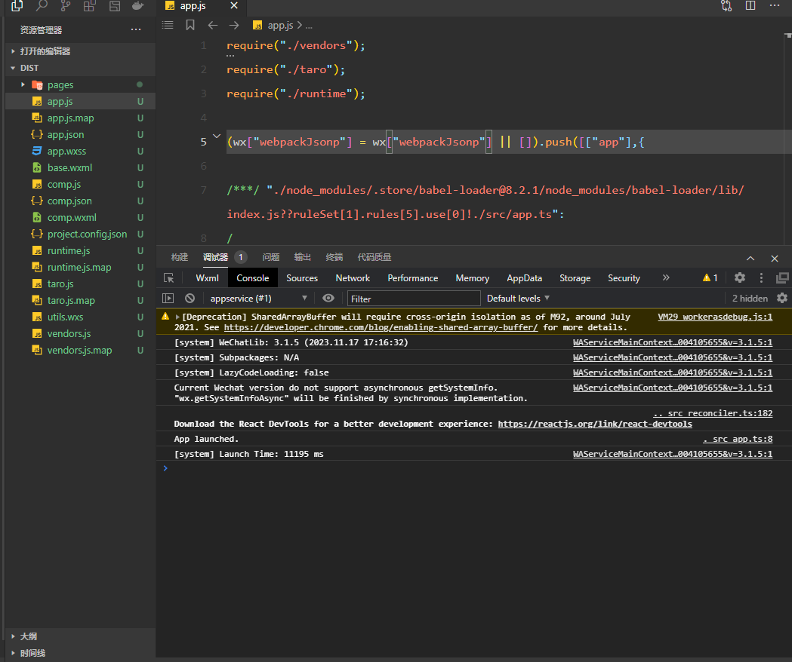
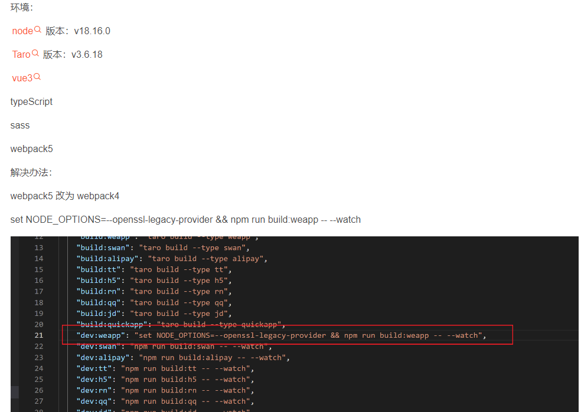
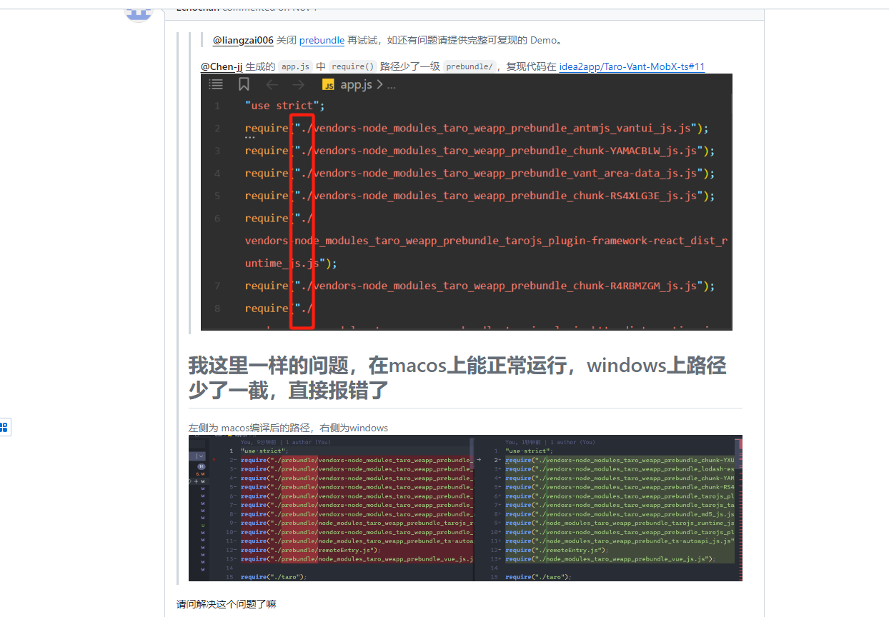
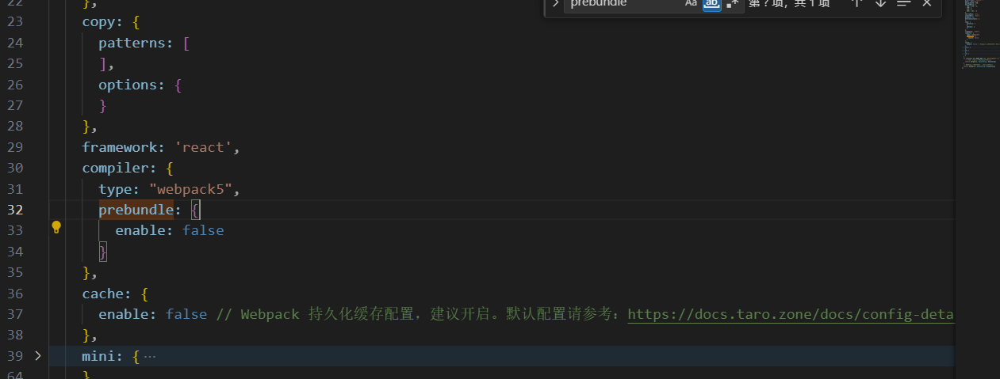

# 关于Taro开发环境路径异常的一些记录

```text
环境信息：
    "react": "^18.0.0",
    "react-dom": "^18.0.0",
    "taro-ui": "^3.1.1",
    "@tarojs/taro": "3.6.18",
    NodeJs：V18.17.0
```


## 1.关于dev环境，app.js入口文件依赖拉取路径错误

通过命令

``` text
npm run dev:weapp
```

启动生成临时文件，微信开发者工具运行时,提示报错，未获取到相关的Js文件



查看app入口文件,编译生成的相关文件被放在prebundle这个文件夹下,生成的入口文件中路径缺少了前缀,拉取不到依赖包



根据Taro官方文档



在开发环境下,会默认开启预编译模式，加快编译速度,所以会生成一个prebundle目录将依赖加入进去

但是在关闭预编译模式下,微信开发者工具依然报错找不到Js文件.但是在目录文件下确实存在这个文件



解决方法就是重启开发工具,再次运行成功，(猜测是自动更新项目时候，相关代码未生产，appJs已经开始运行，所以没找到相关文件,具体原因也没找到)



关于预编译模式下入口文件prebundle前缀丢失的问题。

查找了相关资料，有说把webpack5改成webpack4的，



以及不同平台编译结果不同的问题



暂未发现什么配置问题

选择直接关闭预编译选项




